## Database Viewer 2019. 
Supports working with MySQL database. Intended to view database structure.

## Installation
1. You must already have JDK and Maven installed on PC.
1. Downloading project source code from GitLab repository.
1. Starting backend server by command
```mvn spring-boot:run```
1. Downloading frontend libraries by command
```npm install``` in frontend folder
1. Starting frontend server by command
```npm start``` in frontend folder
1. You may check localhost:3000 for application start page loading.

## Usage
First the user may connect to database using IP address, port, user name and password for database.
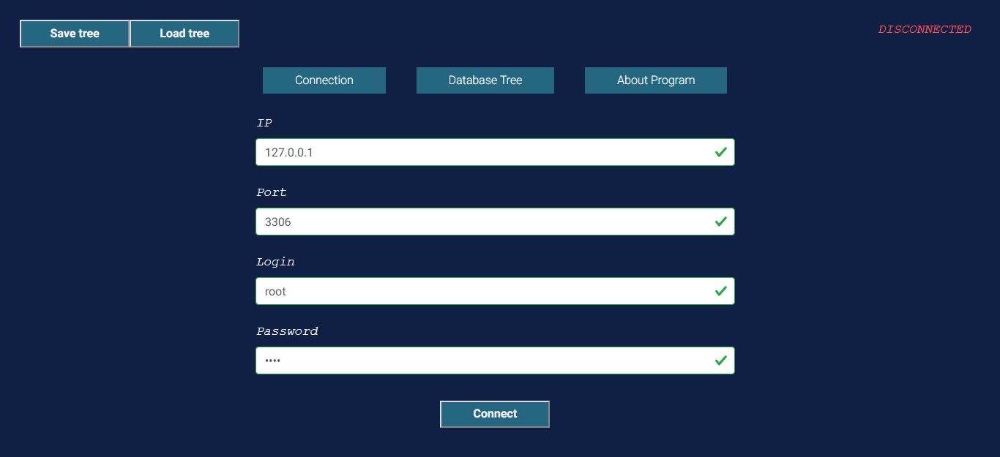

There is validation for input data in connection form.
User must enter:
 - Valid IP address
 - Port number from 1 to 65535
 - Login of 3 - 100 symbols
 - Password of 3 - 100 symbols
 
In case incorrect input submit form button will be blocked and user will get appropriate error messages.
    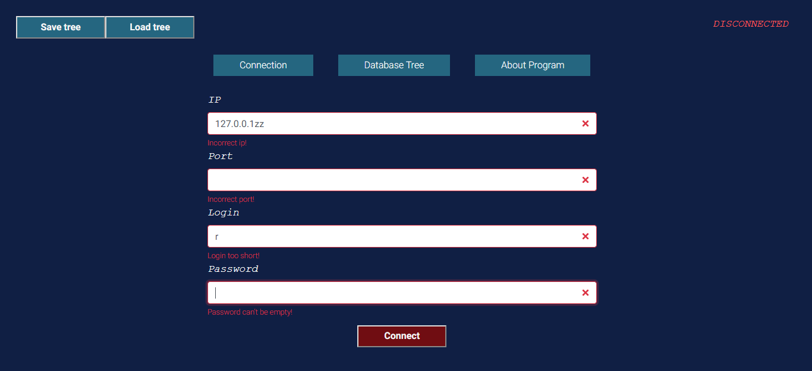

Offline mode: User can press Load tree button to get saved in xml file tree.
    

Received from xml nodes have yellow color.

   

In case correct credentials input, user may connect to database and receive version of connection driver. 
    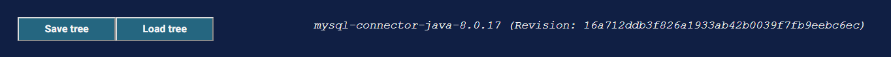

After establishing database connection user can load next nodes from database,
received from database nodes have green color.
    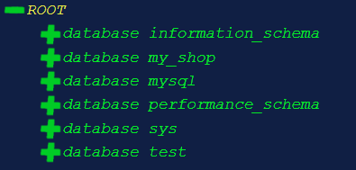

In any time user can save tree in xml file via Save tree button.

User can open and close tree nodes, view their properties, in particular, a DDL script to create
- Views:
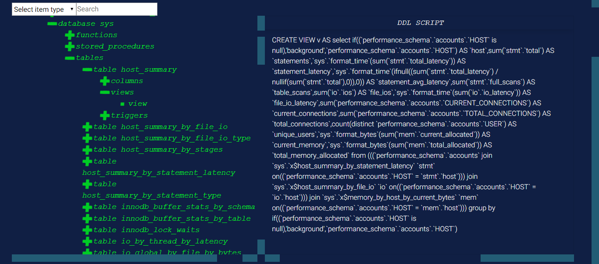

- Stored procedures:
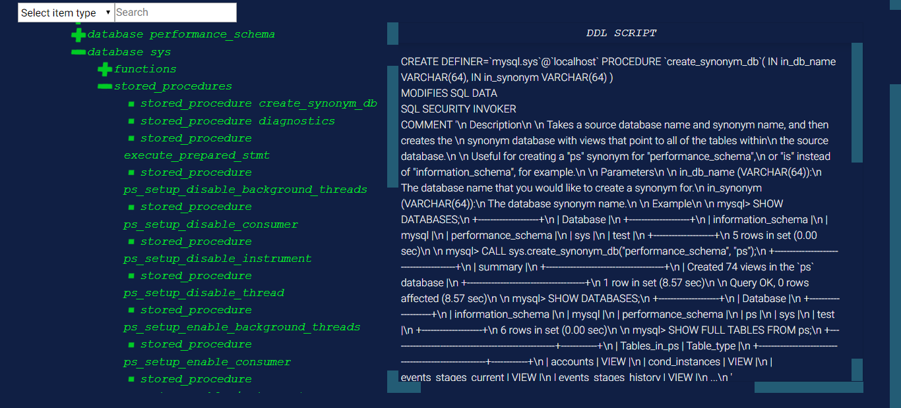

- Triggers:
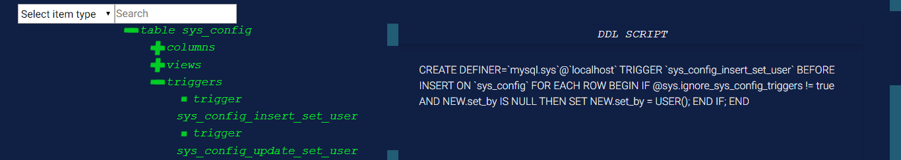

- Functions:
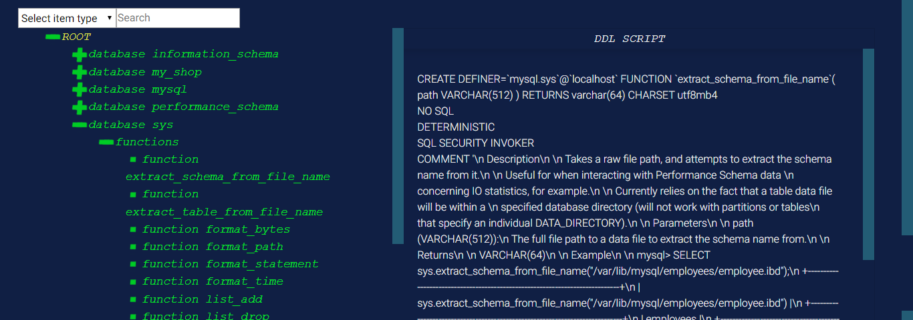

- Tables:
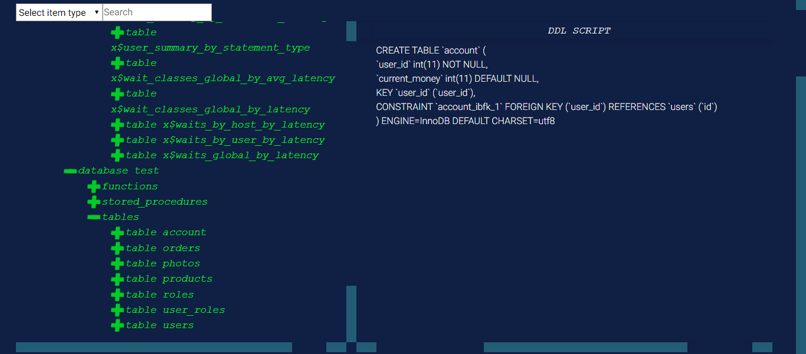

- Keys:
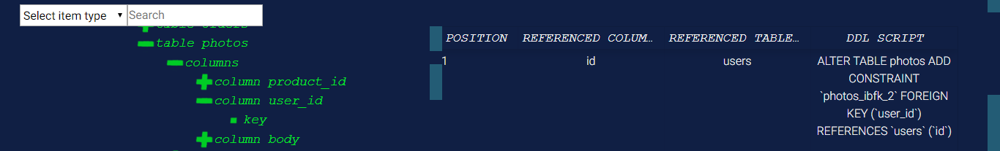

Also, user can:
- Look column properties, ets.
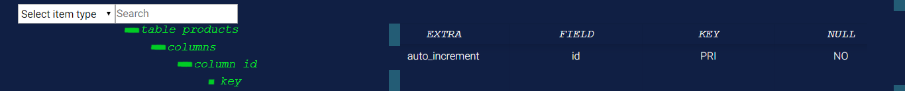

- Filter nodes in tree.

    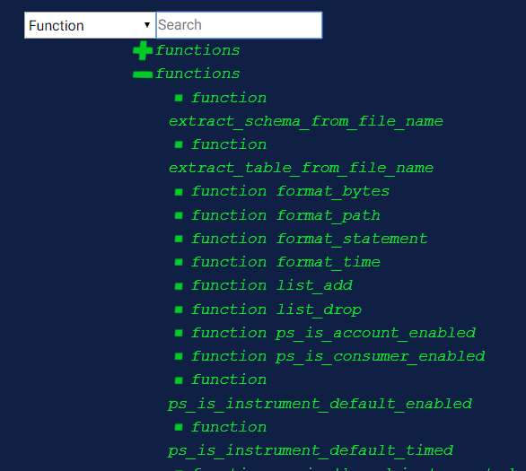

- Search nodes.

    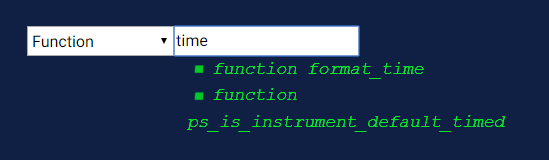
    
## Development
    
## Integration

You can connect Jenkins to this project using next pipeline script:    

```
pipeline {
	agent any
	stages {
		stage('== Update resources ==') {
			steps {
				checkout([
				    $class: 'GitSCM',
				    branches: [[name: '*/master']], 
				    doGenerateSubmoduleConfigurations: false, 
				    extensions: [], 
				    submoduleCfg: [], 
				    userRemoteConfigs: [
				        [
		    	            credentialsId: '1ffb08cf-ac0a-4b2a-97e1-084f3ccdc185',
				            url: 'https://gitlab.kharkov.dbbest.com/java-students/anatolii-nosenko-student-project.git'
				        ]
				    ]
				])
			}
		}
		
		stage ('== Stop current project ==') {
			steps {
				bat 'stop_node'
				bat 'stop_backend'
			}			
		}
		
		stage ('== Build == ') {
			parallel {
				stage ('== Starting backend server ==') {
					steps {
					    bat 'if not exist anatolii-nosenko-student-project\\temp_data mkdir anatolii-nosenko-student-project\\temp_data'
					    bat 'start_backend_tests'
						bat 'start_backend'
					}
				}
	
				stage ('== Downloading frontend libraries and start frontend server ==') {
					steps {
						bat 'npm_install'
						bat 'start_frontend_test'
						bat 'npm_start'
					}
				}
			}
		}
	}
}
```

There are bat files in project, that restarts application and you can rebuild project via Jenkins 
if repository receive commit.
